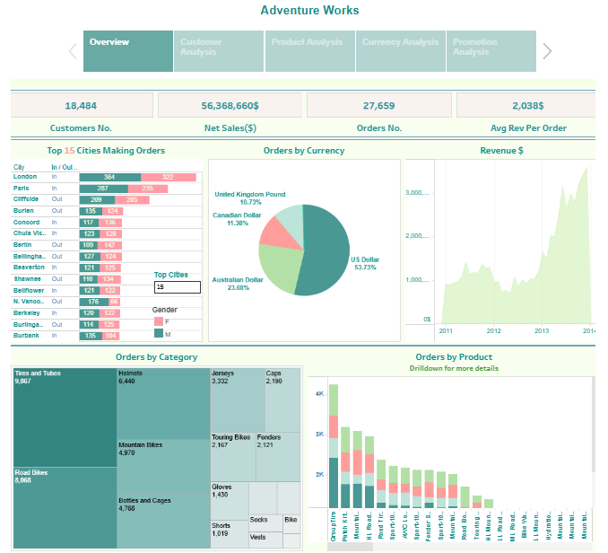

# Adventure Works Internet Sales Dashboard

This project is an interactive sales dashboard built using *Tableau* with data sourced from Microsoft's Adventure Works dataset. The goal is to provide business insights regarding internet sales performance, customer demographics, product sales trends, currency analysis, and the effectiveness of promotions.

## Project Objectives
- Analyze internet sales performance across cities and currencies.
- Identify top-selling products and categories.
- Understand customer demographics by age, gender, and education.
- Forecast sales trends and evaluate promotion effectiveness.

## Dataset
The data used in this project comes from the *Adventure Works DW*.  
Tables used include: Sales, Customers, Products, Promotions, and Currency information.

---

## Dashboard Pages Overview

### 1. Internet Sales Overview
- *KPIs:* 
  - Customer Number: 18,484
  - Net Sales: $56,368,660
  - Order Number: 27,659
  - Avg Revenue Per Order: $2,038

- *Visualizations:*
  - Top 15 Cities Making Orders
  - Orders by Currency
  - Revenue Trend Over Time
  - Orders by Category
  - Orders by Product

---

### 2. Customers Analysis
- *KPIs:*
  - Order Number: 27,659
  - Customer Number: 18,484

- *Visualizations:*
  - Orders Per Age Classification
  - Customers Per Product
  - Customers Per Gender
  - Customers Per Education Level

---

### 3. Product Analysis
- *KPIs:*
  - Product Number: 504
  - Sold Quantity: 60,398

- *Visualizations:*
  - Orders Over Time
  - Sold Quantity by SubCategory
  - Net Sales by Class
  - Sold Quantity by Category

---

### 4. Currency Analysis
- *KPIs:*
  - Net Sales ($)
  - Sold Quantity

- *Visualizations:*
  - Top 5 Currencies
  - Number of Customers per Currency
  - Quantity Sold per Currency
  - Profit Forecasting and Trend

---

### 5. Promotion Analysis
- *KPIs:*
  - Profit
  - Promotion Number

- *Visualizations:*
  - Promotion Number by Promotion Category
  - Profit by Promotion Type
  - Promotion Number by Product Category

---

## Tools & Technologies
- *Tableau Public*
- *Adventure Works DW*
- Data Modeling & Dashboard Design

---

## 🔗 Live Dashboard  
[Click here to view the interactive Tableau dashboard](https://public.tableau.com/views/Lap2_16859775057350/AdventureWorks?:language=en-US&:sid=&:redirect=auth&:display_count=n&:origin=viz_share_link)

---

## 📸 Dashboard Screenshots

### 1. Overview Page  
Shows internet sales performance summary and key metrics.  

### 2. Customer Analysis Page  
Analyzes customer demographics and product preferences.  

### 3. Product Analysis Page  
Displays product sales trends and quantities sold.  

### 4. Currency Analysis Page  
Highlights sales and profit trends by currency.  

### 5. Promotion Analysis Page  
Reviews the impact of promotions on sales and profit.  

